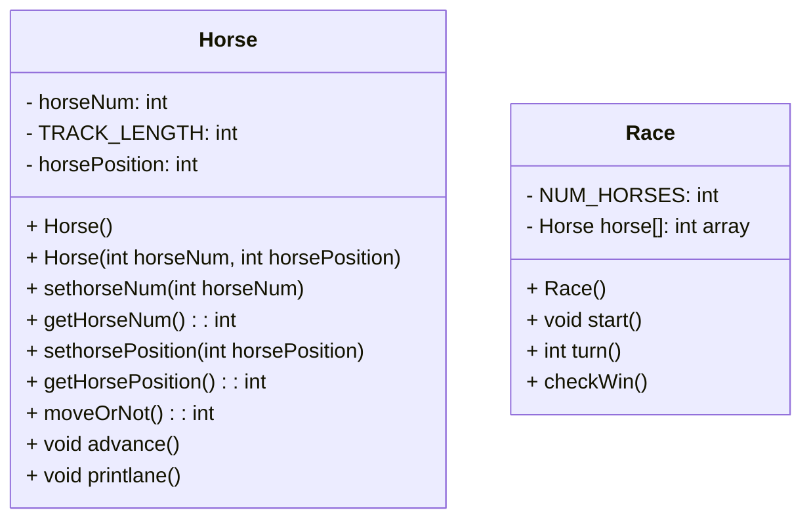

# CS121_Project5

## UML Diagram

```mermaid
classDiagram

    class Horse{
        - horseNum: int
        - TRACK_LENGTH: int
        - horsePosition: int
        + Horse()
        + Horse(int horseNum, int horsePosition)
        + sethorseNum(int horseNum)
        + getHorseNum(): int
        + sethorsePosition(int horsePosition)
        + getHorsePosition(): int
        + moveOrNot(): int
        + void advance()
        + void printlane()
    }
    
    class Race{
        - NUM_HORSES: int
        - Horse horse[]: int array
        + Race()
        + void start()
        + int turn()
        + checkWin()
    }
```
